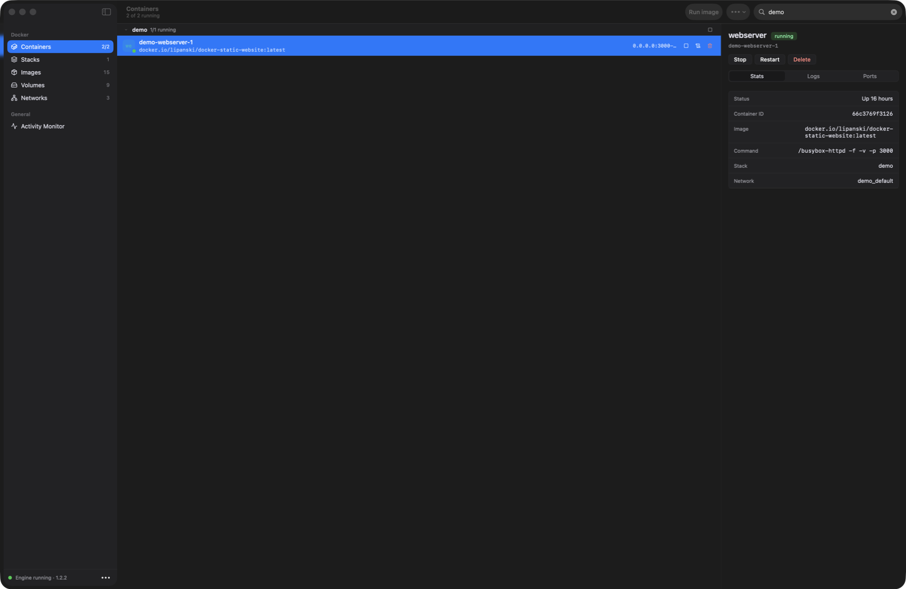
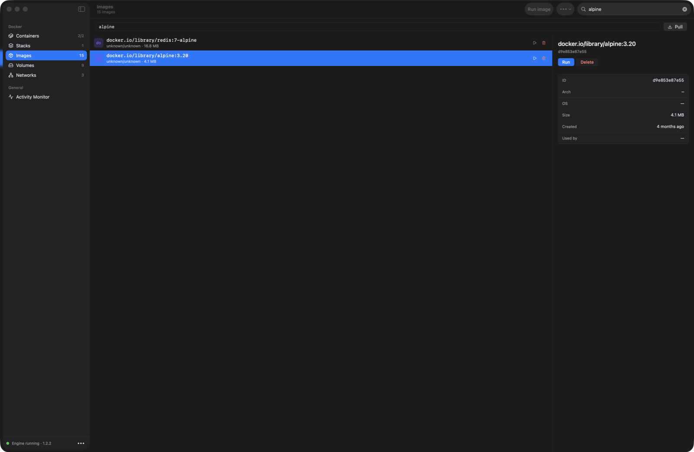

# ContainerStack

[](https://github.com/bshk-app/ContainerStack/actions/workflows/ci.yml)

A native macOS app and `cstack` CLI for Apple Container, with a Docker-compatible
socket via [socktainer](https://github.com/beshkenadze/socktainer).

The GUI never replaces `/var/run/docker.sock`. The Docker CLI context
`containerstack` is created only when you turn **Use as Docker Context** on.

## Interface

[](docs/images/containers.png)

<p align="center"><sub>Compose-aware container groups, lifecycle actions, logs, ports, and runtime state.</sub></p>

[](docs/images/images.png)

<p align="center"><sub>Searchable image inventory with run, delete, size, architecture, and usage details.</sub></p>


## Build

Requires macOS 26 and Swift 6.2+.

```sh
swift build --product ContainerStack
swift build --product cstack
swift build --product ContainerStackRuntime
scripts/stage-containerstack-app.sh build/ContainerStack.app
open build/ContainerStack.app
```

`stage-containerstack-app.sh` needs a socktainer binary. Build the pinned
revision with `scripts/prepare-v1-runtime.sh`, or set `SOCKTAINER_BINARY`.

## Socket

Default: `unix://$HOME/.socktainer/container.sock`.

```sh
export DOCKER_HOST="unix://$HOME/.socktainer/container.sock"
docker info
```

## Release

`zamokctl` owns the release signature: codesign, notarization, stapling, and DMG
packaging all happen inside the CLI. GitHub Releases stores the DMG and GitHub
Pages serves the EdDSA-signed Sparkle feed, so no server sits between a release
and its users.

```sh
task signing:notary-profile   # once per Mac, through AgentVault
task release PUBLISH=0        # draft: no feed, no cask
task release                  # publish asset, sign the feed, update the cask
```

Copy `agentvault.yaml.example` to the gitignored `agentvault.yaml` and point its
three logical fields at the 1Password notarization item before the one-time setup.

`CHANGELOG.md` is the release-notes SSOT. The section matching `VERSION` becomes
both the Sparkle update description and the GitHub Release body, byte-for-byte
from the same extracted Markdown file.

## License

MIT. Lucide icons are ISC (`Sources/ContainerStackApp/Resources/Lucide/LICENSE`).
The staged socktainer sidecar is Apache-2.0; its license is copied next to the
binary at staging time.
